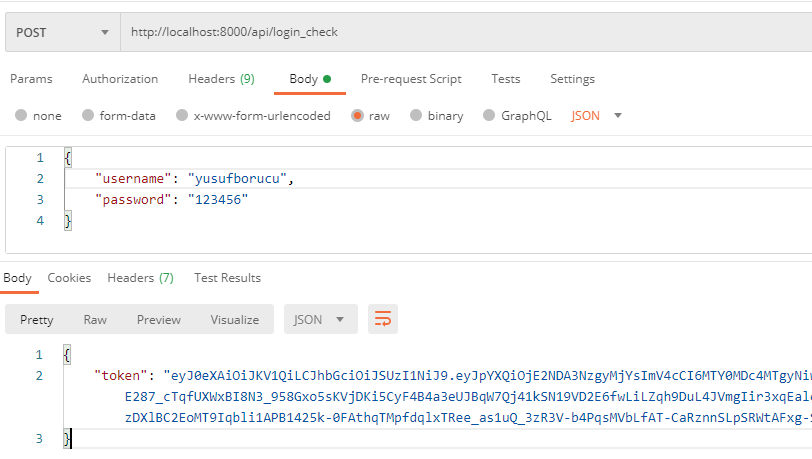
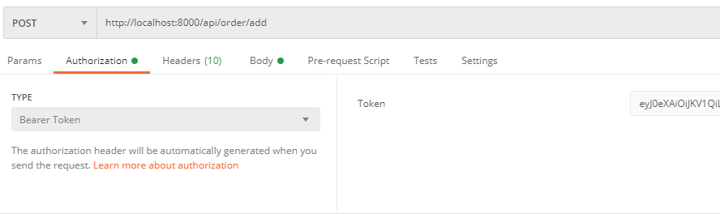
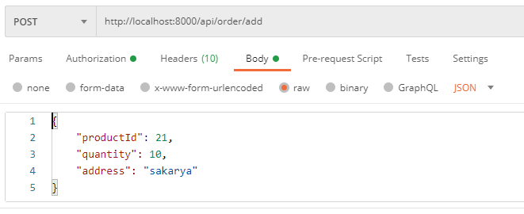
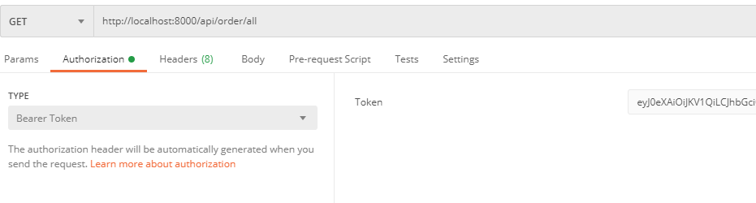

# Path Case

Path Study Case

## Run the Project

  - Clone the git repository
    `git clone https://github.com/yusufborucu/path-case`
  - Modify the `.env` file in accordance with your database settings.
  - Install required packeges by running; `composer install` and update if necessary `composer update` 
  - Run the migrations
    `php bin/console doctrine:migrations:migrate`
  - Run the fixtures load for fake product and user datas
    `php bin/console doctrine:fixtures:load`
  - Run this code for generate jwt keys
    `php bin/console lexik:jwt:generate-keypair`
  - Run the server
    `symfony server:start`

## Run the tests
Run the unit tests 
`php ./vendor/bin/phpunit`

## Import Postman Collection

import `public/postman/past-case.postman_collection.json` file to Postman

## Request Examples

### Get auth token

### Add order

### List all orders

